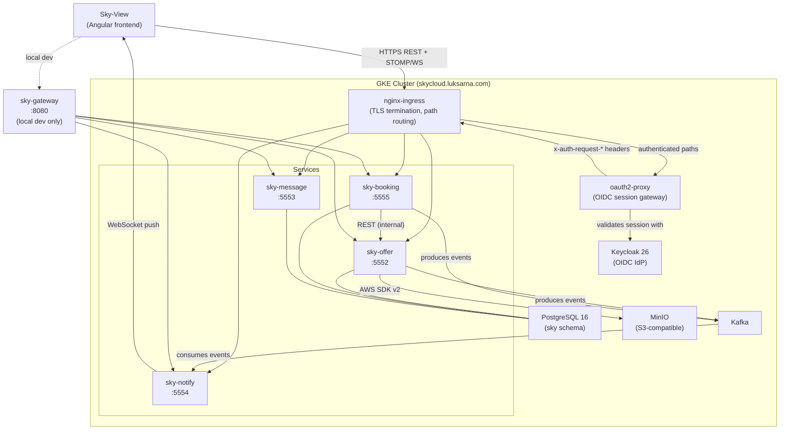
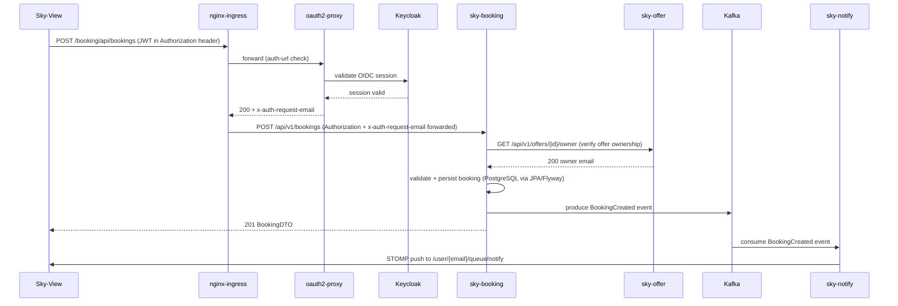

# Sky

Spring Boot microservices backend for a flight and offer booking platform.


---

### What it is

Sky is the backend for a flight and offer booking platform. Five independently-deployable Spring Boot services cover
offers (with photo storage in MinIO), bookings, user-to-user messaging, real-time push notifications, and
local-development gateway routing. A sixth module, [sky-common](sky-common/), is a shared library of wire types and
Spring auto-configurations that the services build on.

The whole platform runs as Helm charts on Google Kubernetes Engine at
[https://skycloud.luksarna.com](https://skycloud.luksarna.com). The
[Sky-View](https://github.com/Lukk17/sky-view) Angular frontend consumes the REST API and connects to the WebSocket
notification endpoint. Authentication is handled by a self-hosted Keycloak 26 instance at
[https://keycloak.luksarna.com](https://keycloak.luksarna.com).

---

### Quick start

Prerequisites: JDK 21 or any JDK capable of running the Gradle daemon (the build toolchain auto-downloads JDK 25 via
the [Foojay resolver](https://github.com/gradle/foojay-toolchains)), Docker, and a running PostgreSQL instance at
`localhost:5432/sky`. See [config/local-dev/local_README.md](config/local-dev/local_README.md) for full local setup.

Build and test all modules:

```bash
./gradlew build
```

```powershell
.\gradlew.bat build
```

Start the full local stack (Kafka + all five services + gateway) using Docker Compose. PostgreSQL, Keycloak, and MinIO
must already be running on the host before you do this:

```bash
docker compose -f config/docker/docker-compose.yaml up
```

```powershell
docker compose -f config/docker/docker-compose.yaml up
```

The gateway is then reachable at `http://localhost:8080`. Individual service ports remain exposed so you can call them
directly during development.

Run a single service with the `local` Spring profile (switches to basic-auth security and local datasource URLs):

```bash
./gradlew :sky-offer:bootRun --args='--spring.profiles.active=local'
```

```powershell
.\gradlew.bat :sky-offer:bootRun --args='--spring.profiles.active=local'
```

---

### Architecture



The ingress layer handles TLS and path-based routing. Authenticated routes go through `oauth2-proxy`, which validates
the OIDC session against Keycloak and forwards the caller's identity in `x-auth-request-email`,
`x-auth-request-access-token`, and `authorization` headers. Downstream services validate the bearer token themselves
as OAuth2 resource servers via `OAUTH2_ISSUER_URI`. Setting `OAUTH2_AUDIENCE=sky-backend` additionally enforces the
audience claim.

`sky-booking` calls `sky-offer` over internal REST to verify offer ownership before creating a booking. `sky-offer`
and `sky-booking` both produce Kafka events; `sky-notify` consumes them and pushes to connected browsers via STOMP
user-destinations (`/user/{email}/queue/notify`). `sky-offer` stores offer photos in MinIO using the AWS SDK v2 with
presigned URLs.

All three stateful services share one PostgreSQL `sky` schema with per-service Flyway migration paths (`V1`, `V2` per
service). When a service starts under the `local` Spring profile, Flyway also applies the repeatable
`R__demo_seed.sql` from `db/demo`, which inserts demo offers and messages idempotently. `sky-notify` is stateless
with no database at all.

Each service uses hexagonal (ports-and-adapters) architecture: `domain/model` and `domain/ports` hold the core,
`adapters/api`, `adapters/notification`, and `adapters/inbound`/`adapters/outbound` hold the I/O. ArchUnit tests
enforce the dependency direction and fail the build if any adapter imports a domain type in reverse.

For local development, `sky-gateway` (Spring Cloud Gateway 5, WebFlux/Netty) runs on port 8080 and mirrors the
production nginx path-rewrite rules, so you do not need to call each service port directly. In production, the
equivalent routing is handled by nginx-ingress in the GKE cluster; `sky-gateway` is not deployed there.

---

### Typical request flow



---

### Modules

| Module | Port | Responsibility |
|---|---|---|
| [sky-booking](sky-booking/) | 5555 | Booking lifecycle: create, list, delete bookings against offers |
| [sky-offer](sky-offer/) | 5552 | Offer CRUD: add, edit, delete, search; photo upload to MinIO |
| [sky-message](sky-message/) | 5553 | User-to-user messaging: send, receive, delete |
| [sky-notify](sky-notify/) | 5554 | Push notifications: consumes Kafka events, pushes over WebSocket |
| [sky-gateway](sky-gateway/) | 8080 | Local-dev edge proxy: path rewriting, optional Keycloak TokenRelay |
| [sky-common](sky-common/) | n/a | Shared library: wire types, Kafka auto-config, web utilities |

Per-module detail, conventions, and data story live in each module's own AGENTS.md:
[sky-booking/AGENTS.md](sky-booking/AGENTS.md),
[sky-offer/AGENTS.md](sky-offer/AGENTS.md),
[sky-message/AGENTS.md](sky-message/AGENTS.md),
[sky-notify/AGENTS.md](sky-notify/AGENTS.md), and
[sky-common/AGENTS.md](sky-common/AGENTS.md).

---

### Stack

| Layer | Technology |
|---|---|
| Runtime | Java 25 (toolchain auto-resolved), Gradle daemon on JDK 21 |
| Framework | Spring Boot 4.0.7, Spring Framework 7 |
| Web | Spring Web (MVC services), Spring WebFlux (sky-gateway, sky-booking) |
| Persistence | Spring Data JPA, PostgreSQL 16, Flyway 11 (BOM-managed) |
| Messaging | Spring Kafka 4 (spring-boot-starter-kafka) |
| Object storage | AWS SDK v2 (2.28.29) with MinIO/S3 presigned URLs |
| Auth | Keycloak 26 OIDC, Spring Security OAuth2 resource server |
| API docs | springdoc-openapi 3.0.3, OpenAPI 3.1, Swagger UI at `/swagger-ui/index.html` |
| Build | Gradle Kotlin DSL, single composite build, version catalogue in [gradle/libs.versions.toml](gradle/libs.versions.toml) |
| Testing | JUnit 5.11, Testcontainers 2.0.5 (PostgreSQL + Kafka), H2 (unit tests), ArchUnit 1.4.2 |
| Resiliency | Resilience4j 2.4.0 (`resilience4j-spring-boot4`) |
| Packaging | fat `bootJar` per service, per-module Dockerfile, Helm charts under [config/k8s/helm/](config/k8s/helm/) |
| CI/CD | GitHub Actions: build-and-test on PR open/reopen, manual release with Docker Hub push and GitHub release |

---

### Features

- REST API under `/api/v1` with Spring Framework 7 native API versioning and RFC 9457 ProblemDetail error bodies.
- Offer photo upload and retrieval via AWS SDK v2 presigned URLs against MinIO (S3-compatible).
- Real-time browser push via STOMP over WebSocket, driven by Kafka events from offer and booking operations.
- OAuth2/OIDC authentication with Keycloak; provider-neutral via `OAUTH2_ISSUER_URI` with optional audience
  enforcement (`OAUTH2_AUDIENCE`).
- Hexagonal (ports-and-adapters) architecture enforced at build time by ArchUnit.
- Demo seed data injected by Flyway repeatable migration on the `local` profile, matching two pre-configured Keycloak
  demo users (`owner@sky.dev`, `user@sky.dev`).
- Single composite Gradle build: one `./gradlew` command covers all six modules.
- Bruno API collection for hands-on testing and three OpenAPI 3.1 specs for code generation.
- Swagger UI per service in the cluster:
  - `https://skycloud.luksarna.com/offer/swagger-ui/index.html`
  - `https://skycloud.luksarna.com/booking/swagger-ui/index.html`
  - `https://skycloud.luksarna.com/msg/swagger-ui/index.html`

---

### Comparison with alternatives

Sky is an intentional learning platform, not a production SaaS. That shapes what it does well and where it falls short.

| Aspect | Sky | Typical production alternative |
|---|---|---|
| Auth provider | Self-hosted Keycloak 26 | Managed IdP (Okta, Auth0, Cognito) |
| Database | Single shared PostgreSQL schema across services | Per-service database (true data isolation) |
| Messaging | Bitnami Kafka on the cluster | Managed Kafka (MSK, Confluent Cloud) |
| Object storage | Self-hosted MinIO | Managed S3 / GCS / Azure Blob |
| API gateway | nginx-ingress + oauth2-proxy in prod, Spring Cloud Gateway locally | Dedicated gateway (Kong, AWS API Gateway) |
| Service-to-service auth | Forwarded bearer token, no mTLS | mTLS with a service mesh (Istio, Linkerd) |
| Observability | Actuator + Prometheus endpoints | Full tracing (OpenTelemetry, Tempo, Grafana) |

Sky wins on: low infrastructure cost (all components self-hosted on a single GKE node pool), a clear hexagonal
structure that is easy to follow, and a complete end-to-end deployment pipeline from code to a real TLS domain.

It loses on: shared schema means a single bad migration can affect all three stateful services, no per-service
database isolation, and the notify service has thin test coverage (~6% branch coverage as of the current branch).

---

### Configuration and ports

The three stateful services (`sky-offer`, `sky-booking`, `sky-message`) share this environment variable set:

| Variable | Default | Notes |
|---|---|---|
| `SPRING_DATASOURCE_URL` | `jdbc:postgresql://host.docker.internal:5432/sky` | Full JDBC URL |
| `POSTGRES_USER` | `sky_user` | Database username |
| `POSTGRES_PASSWORD` | `sky_pass` | Database password |
| `KAFKA_ADDRESS` | `kafka-service` | Kafka bootstrap host |
| `KAFKA_PORT` | `9092` | Kafka bootstrap port |
| `SPRING_DEBUG` | `INFO` | Spring log level |
| `SHOW_SQL_QUERIES` | `false` | Log Hibernate SQL |
| `ACCESS_CONTROL_ALLOW_ORIGIN` | `https://skycloud.luksarna.com` | CORS allowed origin |
| `OAUTH2_ISSUER_URI` | (required) | OIDC issuer URI, e.g. `http://localhost:8080/realms/sky` |
| `OAUTH2_AUDIENCE` | (optional) | When set to `sky-backend`, enforces the audience claim |

`sky-notify` requires `OAUTH2_ISSUER_URI` and `KAFKA_ADDRESS`/`KAFKA_PORT` but has no database variables.

`sky-gateway` in local dev:

| Variable | Default | Notes |
|---|---|---|
| `BOOKING_URI` | `http://localhost:5555` | Upstream URL for sky-booking |
| `OFFER_URI` | `http://localhost:5552` | Upstream URL for sky-offer |
| `MESSAGE_URI` | `http://localhost:5553` | Upstream URL for sky-message |
| `NOTIFY_URI` | `http://localhost:5554` | Upstream URL for sky-notify |
| `GATEWAY_PORT` | `8080` | Port the gateway listens on |

Start the gateway with `SPRING_PROFILES_ACTIVE=secure` to enable the Keycloak OIDC login flow and TokenRelay filter.
This requires `KEYCLOAK_ISSUER_URI`, `KEYCLOAK_CLIENT_ID`, and `KEYCLOAK_CLIENT_SECRET`.

Gateway route table (mirrors the production nginx rewrite rules):

| Incoming path | Upstream | Rewritten to |
|---|---|---|
| `/booking/api/**` | sky-booking:5555 | `/api/v1/{remainder}` |
| `/offer/api/**` | sky-offer:5552 | `/api/v1/{remainder}` |
| `/msg/api/**` | sky-message:5553 | `/api/v1/{remainder}` |
| `/notify/**` | sky-notify:5554 | passthrough (WebSocket) |

---

### Local development

The local stack targets these endpoints and credentials. All values listed here are
local-development-only, non-secret, intentionally committed values for the local Docker stack.
Real environments inject secrets via Kubernetes sealed-secrets and environment variables; none of
the values below appear in any production system.

| Service | URL | Credentials |
|---|---|---|
| Keycloak admin console | https://keycloak.test:9443 | admin / admin |
| Keycloak sky realm | https://keycloak.test:9443/realms/sky | issuer URI for services |
| Keycloak client | sky-backend | secret: dev-only-change-in-prod |
| Demo user: owner | realm sky | username owner, password owner, role user |
| Demo user: user | realm sky | username user, password user, role user |
| Demo user: lukk | realm sky | username lukk, password test1234, role admin |
| PostgreSQL | localhost:5432 | database sky, user sky_user, password sky_pass |
| MinIO | http://localhost:9070 | access key admin, secret key password |
| Kafka | localhost:9092 | no auth, managed by Docker Compose |

`keycloak.test` must resolve to `127.0.0.1` in the hosts file (`/etc/hosts` or
`C:\Windows\System32\drivers\etc\hosts`). The four services default to
`OAUTH2_ISSUER_URI=https://keycloak.test:9443/realms/sky` when the variable is not set, so a bare
`./gradlew :sky-offer:bootRun` against the local stack works without exporting any variable.

Keycloak uses a self-signed TLS certificate. The JVM rejects it by default. Either import the cert
into a local truststore and pass `-Djavax.net.ssl.trustStore=...` at startup, or import it into the
JDK cacerts store. The full step-by-step procedure, including `openssl` and `keytool` commands with
both PowerShell and Unix variants, is in
config/keycloak/SETUP.md.

For the full Keycloak realm import runbook, see
config/keycloak/SETUP.md.
For Docker Compose and Minikube setup, see
config/local-dev/local_README.md.

---

### Testing

Run all tests from the repo root:

```bash
./gradlew test
```

```powershell
.\gradlew.bat test
```

Run tests for one module:

```bash
./gradlew :sky-booking:test
```

```powershell
.\gradlew.bat :sky-booking:test
```

The test stack per service:

- Unit tests use JUnit 5, H2 in-memory database, and `@WithMockUser` Spring Security test support.
- Integration tests use Testcontainers 2.x (PostgreSQL + Kafka containers via `@ServiceConnection`). Docker must be
  running on the host.
- Architecture tests use ArchUnit 1.4.2 to enforce hexagonal layer direction in every module.
- API collection in [docs/api/request/](docs/api/request/) (Bruno) covers the end-to-end flow against the local
  gateway or production.

JaCoCo HTML coverage reports land in `build/reports/jacoco/test/html/` per module after each test run.

---

### Deployment

Full deployment detail is in [config/k8s/helm/helm_README.md](config/k8s/helm/helm_README.md). Short version:

Each service builds as a fat `bootJar`, gets containerized by a per-module Dockerfile (e.g.
[sky-offer/docker/Dockerfile](sky-offer/docker/Dockerfile)), and is deployed as a Helm chart under
[config/k8s/helm/service/](config/k8s/helm/service/).

Infrastructure install order (each step is independent; partial installs are safe to resume):

1. Sealed Secrets controller (`config/k8s/helm/api-gateway/sealed-secrets-controller/`)
2. Keycloak with its own backing PostgreSQL (`config/k8s/helm/infra/keycloak/`)
3. oauth2-proxy (`config/k8s/helm/api-gateway/oauth2-proxy/`)
4. App PostgreSQL + PVC (`config/k8s/helm/db/`)
5. MinIO (`config/k8s/helm/infra/minio/`)
6. Kafka (`config/k8s/helm/kafka/`)
7. Service charts: sky-offer, sky-booking, sky-message, sky-notify

The CI pipeline (`.github/workflows/ci.yaml`) builds and tests all modules once when a pull request is opened or
reopened, and on demand. The release pipeline (`.github/workflows/release.yaml`) is manually triggered: it builds and
pushes all five service images to Docker Hub (`lukk17/sky-*`) and then pauses at a required-reviewer approval gate
before cutting a GitHub release.

---

### Docs map

| Document | What it covers |
|---|---|
| [AGENTS.md](AGENTS.md) | Repository-wide agent instructions, skill index, subagent guide |
| [sky-common/AGENTS.md](sky-common/AGENTS.md) | Shared library conventions |
| [sky-booking/AGENTS.md](sky-booking/AGENTS.md) | Booking service conventions and data story |
| [sky-offer/AGENTS.md](sky-offer/AGENTS.md) | Offer service conventions and data story |
| [sky-message/AGENTS.md](sky-message/AGENTS.md) | Message service conventions and data story |
| [sky-notify/AGENTS.md](sky-notify/AGENTS.md) | Notify service conventions and coverage note |
| [docs/api/README.md](docs/api/README.md) | API docs overview: Bruno collection, token minting, gateway routing |
| [docs/api/request/](docs/api/request/) | Bruno API collection (hands-on HTTP testing) |
| [docs/api/openapi/](docs/api/openapi/) | OpenAPI 3.1 specs for sky-booking, sky-offer, sky-message |
| [config/k8s/helm/helm_README.md](config/k8s/helm/helm_README.md) | Helm chart install, upgrade, and troubleshooting |
| [config/local-dev/local_README.md](config/local-dev/local_README.md) | Local dev: Gradle, Docker Compose, Minikube |
| [config/keycloak/README.md](config/keycloak/README.md) | Keycloak realm-as-code: import, token minting, demo users |
| [config/keycloak/SETUP.md](config/keycloak/SETUP.md) | Keycloak local setup runbook: realm import, cert trust, user management |
| [sky-gateway/README.md](sky-gateway/README.md) | Gateway route table and secure profile setup |

---

### License

This project is for personal and educational use. No open-source license is attached.
