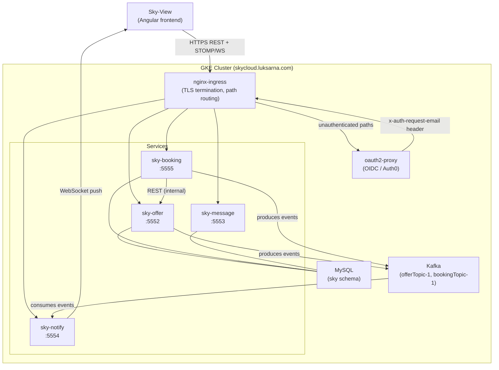

# Sky

*Spring Boot microservices backend for a flight/offer booking platform.*


---

### What it is

Sky is the backend for a flight/hotel offer booking platform. Four independently-deployable Spring Boot services handle
offers, bookings, user-to-user messaging, and real-time push notifications. A fifth module, `sky-common`, is a shared
library that holds wire types and Spring auto-configurations consumed by all four services.

The whole project is deployed as Helm charts on Google Kubernetes Engine at
[https://skycloud.luksarna.com](https://skycloud.luksarna.com). The [Sky-View](https://github.com/Lukk17/sky-view)
frontend consumes the REST API and connects to the WebSocket notification endpoint.

---

### Modules

| Module | Port | Responsibility |
|---|---|---|
| [sky-booking](./sky-booking/) | 5555 | Booking lifecycle: create, list, delete bookings against offers |
| [sky-offer](./sky-offer/) | 5552 | Offer CRUD: add, edit, delete, search flight/hotel offers |
| [sky-message](./sky-message/) | 5553 | User-to-user messaging: send, receive, delete messages |
| [sky-notify](./sky-notify/) | 5554 | Push notifications: consumes Kafka events, pushes to clients over WebSocket |
| [sky-common](./sky-common/) | n/a | Shared library: wire types, Kafka auto-config, web utilities |

Per-module detail, local conventions, and data story live in each module's own
[sky-booking/AGENTS.md](sky-booking/AGENTS.md),
[sky-offer/AGENTS.md](sky-offer/AGENTS.md),
[sky-message/AGENTS.md](sky-message/AGENTS.md),
[sky-notify/AGENTS.md](sky-notify/AGENTS.md), and
[sky-common/AGENTS.md](sky-common/AGENTS.md).

---

### Architecture



The ingress layer handles TLS termination and path-based routing. Authenticated routes go through `oauth2-proxy`,
which validates the OIDC session with Auth0 and forwards the caller's email in the `x-auth-request-email` header.
Services read identity only from that header; they never see tokens. `sky-notify` is the exception: it also validates
JWTs itself via `spring-boot-starter-oauth2-resource-server` so the STOMP connection can be authenticated before the
WebSocket upgrade.

`sky-booking` calls `sky-offer` over internal REST to verify offer ownership before creating a booking. `sky-offer`
and `sky-booking` both produce Kafka events; `sky-notify` consumes them and pushes to the connected browser via STOMP
user-destinations (`/user/{email}/queue/notify`).

All three stateful services (`sky-offer`, `sky-booking`, `sky-message`) share one MySQL `sky` schema with per-service
Flyway migration paths. `sky-notify` is stateless with no database at all.

Each service uses hexagonal (ports-and-adapters) architecture: `domain/model` and `domain/ports` hold the core,
`adapters/api`, `adapters/notification`, and `adapters/inbound`/`adapters/outbound` hold the I/O. ArchUnit tests
enforce that adapters never import domain internals in reverse.

---

### Build

The project is a single composite Gradle build. One root `gradlew` covers all five modules.

Build everything:

```bash
./gradlew build
```

```powershell
.\gradlew.bat build
```

Run a specific service (example: sky-offer):

```bash
./gradlew :sky-offer:bootRun --args='--spring.profiles.active=local'
```

```powershell
.\gradlew.bat :sky-offer:bootRun --args='--spring.profiles.active=local'
```

The JDK 21 toolchain is auto-downloaded by the
[Foojay resolver](https://github.com/gradle/foojay-toolchains) declared in
[settings.gradle.kts](settings.gradle.kts). You do not need to install JDK 21 manually if you already have any JDK
that can run Gradle. All version pins live in [gradle/libs.versions.toml](gradle/libs.versions.toml), bump there,
not per-module.

---

### Environment variables

The three stateful services read the following variables (shown with Docker defaults). All env names are the same
across services unless noted.

| Variable | Default | Notes |
|---|---|---|
| `MYSQL_USER` | (required) | Database username |
| `MYSQL_PASS` | (required) | Database password |
| `SPRING_DATASOURCE_URL` | `jdbc:mysql://host.docker.internal:3306/sky` | Full JDBC URL |
| `KAFKA_ADDRESS` | `kafka-service` | Kafka bootstrap host |
| `KAFKA_PORT` | `9092` | Kafka bootstrap port |
| `SPRING_DEBUG` | `INFO` | Spring log level |
| `SHOW_SQL_QUERIES` | `false` | Log Hibernate SQL |
| `ACCESS_CONTROL_ALLOW_ORIGIN` | `https://skycloud.luksarna.com` | CORS allowed origin |

`sky-notify` additionally requires:

| Variable | Notes |
|---|---|
| `OAUTH2_ISSUER_URI` | OIDC issuer URI (e.g. `https://lukk17.eu.auth0.com/`). Required; no default. |
| `NOTIFY_PORT` | Default `5554` |

---

### Testing

Run all tests from the repo root:

```bash
./gradlew test
```

```powershell
.\gradlew.bat test
```

Run tests for one module:

```bash
./gradlew :sky-booking:test
```

The test stack per service:

- Unit tests use JUnit 5, H2 in-memory DB, and `@WithMockUser` Spring Security test support.
- Integration tests use Testcontainers 2.x (MySQL + Kafka containers via `@ServiceConnection`). Docker must be running.
- Architecture tests use ArchUnit to enforce hexagonal layer direction in every module.
- E2E tests live in [config/postman-collection/](config/postman-collection/) as an exportable Postman collection.

JaCoCo HTML coverage reports land in `build/reports/jacoco/test/html/` per module after each test run.

---

### Deployment

Full deployment detail is in [config/k8s/helm/helm_README.md](config/k8s/helm/helm_README.md) and
[config/k8s/k8s_README.md](config/k8s/k8s_README.md). Short version:

The cluster runs on GKE. Each service ships as a fat `bootJar` built by Gradle, containerized via a
[per-module Dockerfile](sky-offer/docker/) (`docker build . -f sky-offer/docker/Dockerfile -t lukk17/sky-offer`), and
deployed as a Helm chart under [config/k8s/helm/service/](config/k8s/helm/service/).

Infrastructure charts (oauth2-proxy, Kafka, MySQL, Sealed Secrets) live under
[config/k8s/helm/](config/k8s/helm/).

Install the full stack in order:

1. Sealed Secrets controller (manages encrypted Kubernetes secrets)
2. `oauth2-proxy` (OIDC gateway)
3. Kafka
4. MySQL
5. Service charts (`sky-offer`, `sky-booking`, `sky-message`, `sky-notify`)

See [config/k8s/helm/helm_README.md](config/k8s/helm/helm_README.md) for the exact `helm install` commands.

**Swagger UI** is available per service at `/swagger-ui/index.html`. In the cluster, use the path-prefixed URLs:

- `https://skycloud.luksarna.com/offer/swagger-ui/index.html`
- `https://skycloud.luksarna.com/booking/swagger-ui/index.html`
- `https://skycloud.luksarna.com/msg/swagger-ui/index.html`

---

### Local development

See [config/local-dev/local_README.md](config/local-dev/local_README.md) for running services locally with Gradle,
Docker Compose, or Minikube.

For local Gradle runs you need MySQL and Kafka running locally or in Docker. The `local` Spring profile
(`--spring.profiles.active=local`) switches to local datasource URLs and basic-auth security instead of oauth2-proxy.

#### Local gateway (`sky-gateway`)

In production, routing and auth are handled by `nginx-ingress` + `oauth2-proxy` on GKE. For local docker-compose
development, `sky-gateway` (Spring Cloud Gateway 2024.0.3 / WebFlux) provides the same path-rewrite behaviour on
`http://localhost:8080`, so you do not need to call each service's port directly.

Route table (mirrors the production nginx rewrite rules):

| Incoming path | Upstream | Rewritten to |
|---|---|---|
| `/booking/api/**` | sky-booking:5555 | `/api/v1/{remainder}` |
| `/offer/api/**` | sky-offer:5552 | `/api/v1/{remainder}` |
| `/msg/api/**` | sky-message:5553 | `/api/v1/{remainder}` |
| `/notify/**` | sky-notify:5554 | passthrough (WebSocket) |

Run the entire local stack (all services + gateway):

```bash
docker compose -f config/docker/docker-compose.yaml up
```

The gateway is then reachable at `http://localhost:8080`. Individual service ports remain exposed so you can call them
directly during development.

**Without authentication (default):** The gateway routes all traffic without any identity check. No Keycloak instance
is required. This is the default for local development.

**With authentication (`secure` profile):** Start the gateway with `SPRING_PROFILES_ACTIVE=secure` and provide:

- `KEYCLOAK_ISSUER_URI` — e.g. `http://localhost:8090/realms/sky`
- `KEYCLOAK_CLIENT_ID` — client registered in Keycloak
- `KEYCLOAK_CLIENT_SECRET` — client secret

In this mode the gateway handles the OIDC login flow and forwards the bearer token to each upstream service via the
`TokenRelay` filter. Services configured as OAuth2 resource servers (`sky-notify`) receive the token in the
`Authorization: Bearer …` header.

---

### DB setup

Flyway runs automatically on startup and applies the `V1__init.sql` migration for each service.

To seed initial data after first start:

```bash
mysql -u <user> -p sky < config/script/sql_commands/sql_offers_insert.sql
```

```bash
mysql -u <user> -p sky < config/script/sql_commands/sql_messages_insert.sql
```

---

### E2E Postman testing

1. Import the collection from [config/postman-collection/](config/postman-collection/).
2. Run the `sky` collection with the Runner.
3. Set run order so `deleteBooking` is second-to-last and `deleteOffer` is last.
4. Skip `inner getOfferOwnerEmail` (no ingress path for that endpoint).
5. Enable "Run collection without stored cookies" in the Runner's Advanced Settings.

Auth0 login via Postman uses the Authorization Code flow. Steps are documented in
[config/k8s/k8s_README.md](config/k8s/k8s_README.md#auth0-login-rest-way) and the collection itself contains a
`cloud/Auth0 Code Flow` folder with the required requests.

---

### Docs map

| Document | What it covers |
|---|---|
| [config/k8s/helm/helm_README.md](config/k8s/helm/helm_README.md) | Helm chart install, upgrade, and troubleshooting |
| [config/k8s/k8s_README.md](config/k8s/k8s_README.md) | Kubernetes cluster access, secrets, kubectl reference |
| [config/local-dev/local_README.md](config/local-dev/local_README.md) | Local dev: Gradle, Docker, Minikube |
| [sky-booking/README.md](sky-booking/README.md) | Booking service endpoints and payload reference |
| [sky-offer/README.md](sky-offer/README.md) | Offer service endpoints and payload reference |
| [sky-message/README.md](sky-message/README.md) | Message service endpoints and payload reference |
| [sky-notify/README.md](sky-notify/README.md) | Notify service: WebSocket endpoint and Kafka topics |
| [sky-common/README.md](sky-common/README.md) | Shared library: what it exports and how to extend it |
