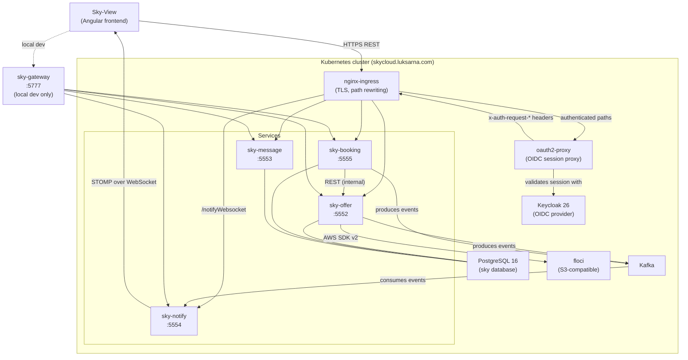
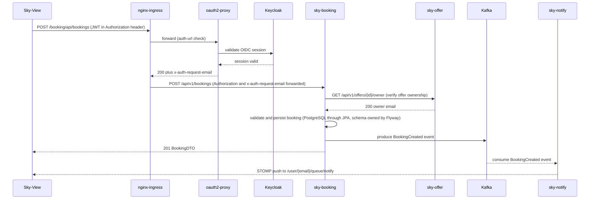

# Sky

Spring Boot microservices backend for a flight and offer booking platform.


-orange?logo=keycloak)


---

### What it is

Sky is the backend for a flight and offer booking platform. Independently deployable Spring Boot services cover offers with photo storage, bookings, user-to-user messaging, and real-time push notifications, on top of a shared library and a local-development gateway. The [Sky-View](https://github.com/Lukk17/sky-view) Angular frontend consumes the REST API and connects to the WebSocket notification endpoint.

The platform runs two ways from the same images: as Helm charts on any Kubernetes cluster, with Google Kubernetes Engine as the production target at [https://skycloud.luksarna.com](https://skycloud.luksarna.com), or locally through Docker Compose behind a Spring Cloud Gateway. Authentication is OAuth2 and OIDC through a self-hosted Keycloak, at [https://keycloak.luksarna.com](https://keycloak.luksarna.com) in production and on your own machine for development.

---

### Quick start

Prerequisites: JDK 25 for the Gradle daemon (the compile toolchain is downloaded automatically by the [Foojay resolver](https://github.com/gradle/foojay-toolchains)), Docker, and three host services: PostgreSQL, Keycloak, and an S3-compatible object store. [config/local-dev/local_README.md](config/local-dev/local_README.md) has one command for each of them.

Build and test every module. Unix shell:

```bash
./gradlew build
```

PowerShell:

```powershell
.\gradlew.bat build
```

Start Kafka, the four services, and the gateway in Docker Compose:

```bash
docker compose -f config/docker/docker-compose.yaml up --build -d
```

The gateway then answers at `http://localhost:5777`, and each service port stays published for direct calls.

Run one service against the local stack instead. Unix shell:

```bash
./gradlew :sky-offer:bootRun --args='--spring.profiles.active=local'
```

PowerShell:

```powershell
.\gradlew.bat :sky-offer:bootRun --args='--spring.profiles.active=local'
```

For a local Kubernetes cluster rather than Compose, go to [config/k8s/local_README.md](config/k8s/local_README.md).

---

### Architecture



The ingress layer handles TLS and path-based routing. Authenticated routes go through `oauth2-proxy`, which validates the OIDC session against Keycloak and forwards the caller's identity in the `x-auth-request-email`, `x-auth-request-access-token`, and `authorization` headers. The services do not trust those identity headers: each one validates the bearer token itself as an OAuth2 resource server using `OAUTH2_ISSUER_URI`, and reads the caller from the token's `email` claim through `SecurityUtils.currentUserEmail()` in `sky-common`. Setting `OAUTH2_AUDIENCE=sky-backend` additionally enforces the audience claim that the realm's mapper writes.

`sky-booking` calls `sky-offer` over internal REST to resolve offer ownership before creating a booking, through Spring's synchronous `RestClient` wrapped in a Resilience4j retry and circuit breaker. When that call cannot complete, the booking answers 503 with a `Retry-After: 10` header and an RFC 9457 problem-detail body, and that covers connection refused, a connect timeout, a read timeout, a 5xx once the three attempts are spent, and an open circuit breaker. An offer that does not exist is still 404. Any other client-error status from `sky-offer` is 502, and 400 stays reserved for a request that really is wrong, such as a date in the past. The breaker records transport failures only, so a run of lookups for offers nobody created cannot open it and turn the next caller's booking into an outage answer. The condition-by-condition table is in [sky-booking/README.md](sky-booking/README.md). Both services produce Kafka events, `sky-notify` consumes them and pushes to connected browsers over STOMP user destinations (`/user/{email}/queue/notify`).

`sky-offer` stores offer photos in an S3-compatible object store through the AWS SDK v2 with presigned URLs, and the server owns the object key. That key is built as `offers/{offerId}/{uuid}-{filename}`, lives in the `photo_object_key` column, is written only by the photo upload endpoint and cleared only by the photo delete endpoint, and appears in no request body and no response body. A client never names an object. It addresses the photo through the offer, with `POST` and `DELETE` on `/api/v1/owner/offers/{offerId}/photo`, and reads the derived `photoUrl` every offer response carries: the presigned address of the uploaded object when there is one, the client-writable `externalPhotoUrl` when there is not, and null when there is neither. Replacing the photo, deleting the photo, and deleting the offer each delete the stored object, so no orphan survives the lifecycle. A store that is down during one of those removals is the deliberate exception: the failure is logged as `photo_delete_failed`, a photo delete still answers 204 and an offer delete still succeeds, so the object outlives the row it belonged to rather than blocking an owner from deleting their own photo or their own offer for the length of an outage. Upload and read do not swallow it. An upload answers 503 with a `Retry-After: 10` header when the store is unreachable or answers 5xx or 429, and 502 Bad Gateway when the store answers 401, 403 or a missing bucket, both as RFC 9457 problem details, and a read that has to sign a stored photo address answers 503 the same way. What the service itself rejects stays 4xx: an empty part and an unsupported image format are 400, an oversized upload is 413. The condition-by-condition table is in [sky-offer/README.md](sky-offer/README.md). Cluster and laptop now run the same store, floci, pinned to the same image digest, and the one adapter would serve a managed S3 just as well, because the only contract is the S3 API. The store has two addresses rather than one: `S3_ENDPOINT` is where the service uploads, `S3_PRESIGN_ENDPOINT` is what a presigned URL names for the client that has to fetch it.

`sky-notify` ships an Ingress in its Helm chart, on `/notifyWebsocket` with `pathType: Prefix` and no rewrite, so a browser reaches the WebSocket in a cluster the same way it reaches everything else. It carries no oauth2-proxy auth annotations, because the STOMP `CONNECT` frame is where the JWT is checked rather than the HTTP handshake, and it raises `proxy-read-timeout` and `proxy-send-timeout` to 3600 seconds so nginx does not close an idle socket after 60. The host is `localhost` with the `dev-ssl-cert` secret locally and `skycloud.luksarna.com` with `sky-tls-cert` in production. Without Kubernetes the route still works the same way: `sky-gateway` passes `/notifyWebsocket/**` straight through to port 5554, so a client connects at `ws://localhost:5777/notifyWebsocket`. The gateway predicate used to be `/notify/**`, which matched nothing, and two gateway tests now pin the working one.

The three stateful services share one PostgreSQL database named `sky`, each with its own Flyway migration path and its own `flyway_schema_history_*` table. Under the `local` Spring profile Flyway also applies the repeatable `R__demo_seed.sql`, which inserts demo offers and messages idempotently. `sky-notify` is stateless with no database at all.

Every service uses hexagonal (ports and adapters) architecture. `domain/model`, `domain/ports/inbound`, and `domain/ports/outbound` hold the core, `adapters/inbound` and `adapters/outbound` hold the I/O, and `domain/service` holds the implementations. ArchUnit tests enforce the dependency direction and fail the build when an adapter reaches into `domain/service`.

For local development, `sky-gateway` (Spring Cloud Gateway on WebFlux and Netty) runs on port 5777 and mirrors the production nginx rewrite rules, so you never call a service port directly. It is also the only module left on the reactive stack. No Helm chart deploys it and no cluster runs it, but the release pipeline still publishes `lukk17/sky-gateway` alongside the four service images, so a Compose stack on any host can pull it rather than build it.

---

### Typical request flow



---

### Modules

| Module | Port | Responsibility |
|---|---|---|
| [sky-offer](sky-offer/) | 5552 | Offer CRUD: add, edit, delete, search, photo upload to object storage |
| [sky-message](sky-message/) | 5553 | User-to-user messaging: send, receive, delete |
| [sky-notify](sky-notify/) | 5554 | Push notifications: consumes Kafka events, pushes over WebSocket |
| [sky-booking](sky-booking/) | 5555 | Booking lifecycle: create, list, delete bookings against offers |
| [sky-gateway](sky-gateway/) | 5777 | Local-development edge proxy: path rewriting, Keycloak token relay outside the `local` profile |
| [sky-common](sky-common/) | none | Shared library: wire types, security and web auto-configurations |

Each module has a README with its endpoints, environment variables, and architecture, and an AGENTS.md with its coding conventions.

---

### Stack

| Layer | Technology |
|---|---|
| Runtime | Java 25 toolchain, Gradle 9 daemon on JDK 25 |
| Framework | Spring Boot 4.0.7, Spring Framework 7 |
| Web | Spring Web (MVC) in all four services, Spring WebFlux only in sky-gateway |
| Persistence | Spring Data JPA, PostgreSQL 16, Flyway |
| Messaging | Spring Kafka through `spring-boot-starter-kafka` |
| Object storage | AWS SDK v2 against any S3 API, floci in the cluster and on a laptop, presigned URLs either way |
| Auth | Keycloak 26 OIDC, Spring Security OAuth2 resource server |
| API docs | springdoc-openapi, OpenAPI 3.1, Swagger UI at `/swagger-ui/index.html` |
| Build | Gradle Kotlin DSL, one composite build, versions in [gradle/libs.versions.toml](gradle/libs.versions.toml) |
| Testing | JUnit 5, Testcontainers (PostgreSQL 17 and Kafka), ArchUnit for layering |
| Resiliency | Resilience4j retry and circuit breaker on the booking-to-offer call. A dependency outage answers 503 with `Retry-After: 10` in both sky-booking and sky-offer, and a dependency that answers unusably is 502 |
| Packaging | Fat `bootJar` per service, per-module Dockerfile, Helm charts under [config/k8s/helm/](config/k8s/helm/) |
| CI/CD | GitHub Actions: build and test on every push to an open pull request, manual release gated on that same build before any image is pushed, with the GitHub release and the `:latest` move behind a required reviewer |

Every version is pinned centrally in [gradle/libs.versions.toml](gradle/libs.versions.toml). Bump it there, never per module.

---

### Features

- REST API under `/api/v1` with Spring Framework 7 native API versioning and RFC 9457 problem-detail error bodies.
- Offer photo upload, replacement, and deletion through AWS SDK v2 presigned URLs against an S3-compatible object store, with magic-byte validation on upload and an object key the server owns outright.
- No orphaned photos on any normal path. Replacing a photo, deleting a photo, and deleting the offer each remove the stored object, so the bucket holds nothing the database does not reference.
- Real-time browser push over STOMP and WebSocket, driven by Kafka events from offer and booking operations.
- OAuth2 and OIDC authentication with Keycloak, provider-neutral through `OAUTH2_ISSUER_URI` and optional audience enforcement.
- Hexagonal architecture enforced at build time by ArchUnit, so a layering mistake fails the build rather than a review.
- Realm as code: one committed Keycloak realm file, imported identically by the local container and the cluster chart.
- Demo seed data applied by a Flyway repeatable migration on the `local` profile, matching the realm's demo users.
- One composite Gradle build: a single `./gradlew` command covers every module.
- Bruno API collection that mints its own token and chains ids, plus OpenAPI 3.1 specs for code generation.

---

### Comparison with alternatives

Sky is a deliberate learning platform rather than a production SaaS, which shapes both what it does well and where it falls short.

| Aspect | Sky | Typical production alternative |
|---|---|---|
| Identity provider | Self-hosted Keycloak 26 | Managed provider (Okta, Auth0, Cognito) |
| Database | One PostgreSQL database shared by three services | A database per service, with real data isolation |
| Messaging | Kafka on the cluster | Managed Kafka (MSK, Confluent Cloud) |
| Object storage | Self-hosted floci in the cluster, an emulator rather than a production store | Managed S3, GCS, or Azure Blob |
| Edge | nginx-ingress plus oauth2-proxy in the cluster, Spring Cloud Gateway locally | A dedicated gateway (Kong, AWS API Gateway) |
| Service-to-service auth | Forwarded bearer token, no mTLS | mTLS through a service mesh (Istio, Linkerd) |
| Observability | Actuator health and Prometheus endpoints | Distributed tracing (OpenTelemetry, Tempo, Grafana) |

Where it wins: low infrastructure cost, since every component is self-hosted on one node pool, a hexagonal structure that is enforced rather than aspirational, a coverage floor the build enforces rather than a review, and a complete path from a commit to a real TLS domain.

Where it loses: the shared database means one bad migration can affect all three stateful services, there is no per-service data isolation, there is no distributed tracing so a slow request has to be followed by correlation id across four log streams by hand, and the committed sealed secret under [config/k8s/secret/sealed/](config/k8s/secret/sealed/) still carries the MySQL-era key names, so a fresh production deploy needs it re-sealed first.

---

### Configuration and ports

The three stateful services (`sky-offer`, `sky-booking`, `sky-message`) share this environment variable set:

| Variable | Default | Notes |
|---|---|---|
| `SPRING_DATASOURCE_URL` | `jdbc:postgresql://host.docker.internal:5432/sky` | Full JDBC URL |
| `POSTGRES_USER` | none, required | Database username, the context fails to start without it |
| `POSTGRES_PASSWORD` | none, required | Database password |
| `KAFKA_ADDRESS` | `kafka-service` | Kafka bootstrap host, the in-cluster service name |
| `KAFKA_PORT` | `9092` | Kafka bootstrap port |
| `OAUTH2_ISSUER_URI` | `https://keycloak.test:9443/realms/sky` | OIDC issuer, the default is the local Keycloak |
| `OAUTH2_AUDIENCE` | unset | Set to `sky-backend` to enforce the audience claim |
| `ACCESS_CONTROL_ALLOW_ORIGIN` | production host plus localhost origins | Comma-separated CORS allowlist |
| `SHOW_SQL_QUERIES` | `false` | Log Hibernate SQL |
| `SPRING_DEBUG` | `INFO` | Spring web log level |

`sky-message` uses no Kafka, so it ignores the two Kafka variables. `sky-notify` needs `OAUTH2_ISSUER_URI`, `KAFKA_ADDRESS`, and `KAFKA_PORT`, and has no database variables at all. `sky-offer` adds the S3 settings documented in [sky-offer/README.md](sky-offer/README.md).

Service ports come from `OFFER_PORT`, `MESSAGE_PORT`, `NOTIFY_PORT`, `BOOKING_PORT`, and `GATEWAY_PORT`, each defaulting to the port in the module table above.

The gateway route table mirrors the production nginx rewrite rules:

| Incoming path | Upstream | Rewritten to |
|---|---|---|
| `/offer/api/**` | sky-offer:5552 | `/api/v1/{remainder}` |
| `/booking/api/**` | sky-booking:5555 | `/api/v1/{remainder}` |
| `/msg/api/**` | sky-message:5553 | `/api/v1/{remainder}` |
| `/notifyWebsocket/**` | sky-notify:5554 | passthrough, no rewrite |

The gateway defaults to the OIDC login flow and the token-relay filter, which need `KEYCLOAK_ISSUER_URI`, `KEYCLOAK_CLIENT_ID`, and `KEYCLOAK_CLIENT_SECRET`. Set `SPRING_PROFILES_ACTIVE=local` to get the permit-all chain instead, which is what Docker Compose does and what a laptop run wants. See [sky-gateway/README.md](sky-gateway/README.md).

---

### Local development

The local stack and its credentials live in [config/local-dev/local_README.md](config/local-dev/local_README.md), which has a start command for PostgreSQL, Keycloak, and the object store, the Docker Compose flow, and the Gradle flow. Every credential in this project is a development-only, non-secret, intentionally committed value, and none of them exists in any deployed system.

JetBrains IDEs read the shared run configurations in [.run/](.run/). They are committed, so everyone gets the same ones, while the whole `.idea` directory is ignored in [.gitignore](.gitignore). Every service has the same three: `sky-<service> clean run` runs `clean bootRun` with `--spring.profiles.active=local`, `sky-<service> docker build` builds that module's image from its own `docker/Dockerfile`, and `Sky<Service>Application` starts the service from the IDE on the `local` profile. `Docker Compose Deployment` and `Docker Compose Deployment force image build` bring up [config/docker/docker-compose.yaml](config/docker/docker-compose.yaml), the second one rebuilding the images and recreating the containers. None of them carries a credential, and none needs one: the local profile pins the database URL and defaults the database user and password, so a local run needs nothing in the environment. Requests still carry a bearer token, which the `local` profile accepts without verifying its signature, and [docs/api/README.md](docs/api/README.md) covers minting one.

Two things catch people out on a first run:

- `keycloak.test` must resolve to `127.0.0.1` in your hosts file, because the services default to `OAUTH2_ISSUER_URI=https://keycloak.test:9443/realms/sky`.
- Keycloak uses a self-signed certificate, so a JVM started on the host rejects the JWKS fetch until the certificate is trusted. The service images already trust it, a host-run `bootRun` does not. The procedure is in [config/keycloak/SETUP.md](config/keycloak/SETUP.md).

---

### Testing

Run every test from the repository root. Unix shell:

```bash
./gradlew test
```

PowerShell:

```powershell
.\gradlew.bat test
```

One module only. Unix shell:

```bash
./gradlew :sky-booking:test
```

PowerShell:

```powershell
.\gradlew.bat :sky-booking:test
```

The test stack per service:

- Unit tests on JUnit 5 with Mockito and Spring Security test support. There is no in-memory database anywhere: H2 is gone from every module and from the version catalogue.
- Integration and repository tests on Testcontainers, wiring `postgres:17-alpine` and Kafka containers through `@ServiceConnection`. Docker must be running.
- Architecture tests on ArchUnit, enforcing the hexagonal layer direction in every module.
- End-to-end runbooks under [e2e/](e2e/), driven through the Bruno collection in [docs/api/request/](docs/api/request/).

JaCoCo HTML coverage reports land in `build/reports/jacoco/test/html/` per module after each run, and the gate reads the same class set the report does: `jacocoTestCoverageVerification` is wired into `check`, so `./gradlew build` fails when a module drops below 0.90 line or 0.90 branch coverage. Five modules are gated: the four services plus the `sky-common` library, which reaches the same convention plugin through `sky.java-conventions`. `sky-gateway` is the one exemption and it opts itself out in its own `build.gradle.kts` rather than being named in the shared plugin, because the measured set excludes `**/dto/**`, `**/config/**`, the application class and `Constants`, which is that module's whole main source set: a rule over an empty counter passes and reports a green tick for nothing measured. Its two filter chains are covered by their own tests instead.

---

### Deployment

Each service builds as a fat `bootJar`, gets containerized by its own Dockerfile (for example [sky-offer/docker/Dockerfile](sky-offer/docker/Dockerfile)), and deploys as a Helm chart under [config/k8s/helm/service/](config/k8s/helm/service/). The four deployment templates wrap `deployment.image.repository` and `deployment.image.tag` in Helm's `required`, so an overlay that drops either one fails the render with the value name instead of deploying an image the cluster cannot pull.

The scripted path is one command. Unix shell:

```bash
./config/k8s/_deployment-scripts/helm/linux/helm-app-deploy.sh
```

Windows:

```bat
.\config\k8s\_deployment-scripts\helm\win\helm-app-deploy.bat
```

The script installs, in order: the Sealed Secrets controller and the sealed secrets, Keycloak with its own backing PostgreSQL, oauth2-proxy, the app PostgreSQL and its PVC, floci, Kafka, and the four service charts. What each of those charts does is [config/k8s/helm/helm_README.md](config/k8s/helm/helm_README.md), and the surrounding GCP and sealed-secret work is [config/k8s/_deployment-scripts/deployment_README.md](config/k8s/_deployment-scripts/deployment_README.md).

CI is at [.github/workflows/ci.yaml](.github/workflows/ci.yaml): it builds and tests every module when a pull request is opened or reopened, on every push to a branch with an open pull request, and on demand. One run per pull request is in flight at a time, so a rapid series of pushes cancels the superseded runs. Cancellation is off for a manual dispatch and for the release gate below, so a release waiting on its tests cannot be killed by someone pushing to a pull request.

The release pipeline at [.github/workflows/release.yaml](.github/workflows/release.yaml) is manual, takes a version, and runs four jobs in order. `validate` checks the dispatched version without a checkout, so a malformed version fails in seconds. `test` calls [.github/workflows/ci.yaml](.github/workflows/ci.yaml) as a reusable workflow from the same commit, which makes the composite build and every test in it the release gate: it takes no input, carries no condition, and `build-and-push` needs it, so a red build stops the release before the first image is pushed. `build-and-push` pushes one version-tagged image per Spring Boot application, so `lukk17/sky-booking`, `lukk17/sky-offer`, `lukk17/sky-message`, `lukk17/sky-notify` and `lukk17/sky-gateway` each at `:v<version>` and nothing else. The published tag carries a leading `v`, the dispatched version does not. `sky-common` has no image, being a library. It then reads each tag back from the registry and fails if one is missing. `github-release` pauses at the approval gate, then pins the four service charts to that version, commits the pin, cuts the GitHub release at that commit, and moves `:latest` onto the released version as its last step. So `helm upgrade` from a release tag deploys the image the release built, and a rejected release leaves `:latest` where it was.

Two details worth knowing before a release. The approval gate is a GitHub environment protection rule on an environment named `release`, so it only actually pauses once that environment carries a required reviewer. And `sky-gateway` gets an image like the rest even though no chart deploys it, so the chart-pinning step logs a notice and skips it, which is why five images are pushed and four charts are pinned.

---

### Docs map

Platform documentation:

| Document | What it covers |
|---|---|
| [config/local-dev/local_README.md](config/local-dev/local_README.md) | Running locally without Kubernetes: Gradle and Docker Compose |
| [config/local-dev/e2e-stack_README.md](config/local-dev/e2e-stack_README.md) | The self-contained Compose stack and the Bruno gate CI runs on it |
| [config/k8s/local_README.md](config/k8s/local_README.md) | Local Kubernetes cluster on k3d: bring-up, verification, teardown |
| [config/k8s/helm/helm_README.md](config/k8s/helm/helm_README.md) | Chart-by-chart reference, secret key inventory, upgrades |
| [config/k8s/_deployment-scripts/deployment_README.md](config/k8s/_deployment-scripts/deployment_README.md) | Deploying to the GCP cluster, sealed secrets, deployment scripts |
| [config/k8s/k8s_README.md](config/k8s/k8s_README.md) | Operating a running cluster with kubectl |
| [config/keycloak/SETUP.md](config/keycloak/SETUP.md) | Keycloak realm, import, certificate trust, users, tokens |
| [docs/api/README.md](docs/api/README.md) | Bruno collection, token minting, gateway routing, OpenAPI specs |
| [e2e/README.md](e2e/README.md) | End-to-end capability suite and how a run is recorded |

Per-module documentation:

| Document | What it covers |
|---|---|
| [sky-offer/README.md](sky-offer/README.md) | Offer endpoints, photo storage, environment variables |
| [sky-booking/README.md](sky-booking/README.md) | Booking endpoints, the outbound call to sky-offer, environment variables |
| [sky-message/README.md](sky-message/README.md) | Message endpoints and environment variables |
| [sky-notify/README.md](sky-notify/README.md) | Kafka topics, the WebSocket contract, JWT validation |
| [sky-gateway/README.md](sky-gateway/README.md) | Gateway route table, the two security profiles, image build |
| [sky-common/README.md](sky-common/README.md) | What the shared library exports and its dependency rules |

Agent and tooling documentation:

| Document | What it covers |
|---|---|
| [AGENTS.md](AGENTS.md) | Repository-wide agent instructions, skill index, subagent guide |
| [docs/AGENT_TOOLING.md](docs/AGENT_TOOLING.md) | How the shared agent standards are imported and wired |
| [docs/MCP_SETUP.md](docs/MCP_SETUP.md) | Configuring the MCP servers this repository ships |
| [docs/GLOBAL_SETUP.md](docs/GLOBAL_SETUP.md) | Installing the agent standards into your home directory |
| [docs/AGENTS-UPDATE.md](docs/AGENTS-UPDATE.md) | Refreshing the imported agent standards |

Two more files exist and are deliberately left out of the tables above, because they document abandoned experiments rather than anything the platform runs: [config/k8s/Xperimantal/kong/kong_README.md](config/k8s/Xperimantal/kong/kong_README.md) and [config/k8s/Xperimantal/keycloak/keycloak_README.md](config/k8s/Xperimantal/keycloak/keycloak_README.md). Both say so in their first line.

---

### License

This project is for personal and educational use. No open-source license is attached.
